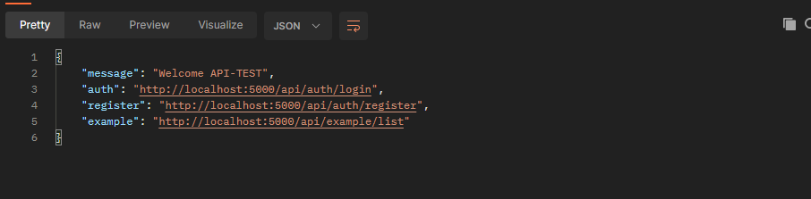

## Levantar proyecto 
> Tener instalado node > v.14 js y npm > v.8
* Instalar dependencias 
     * npm i
* Iniciar proyecto 
    > Opcionalmente  ver los scripts que se pueden ejecutar
    * npm run
    > Levanta proyecto en modo desarrollo
    * npm run dev 

## Ya tiene las configuraciones de eslint y prietter, tener instalados dichas extenciones

## configuración de variables de entono
 > En el archivo .env.example se muestran ejemplos de las variables de entorno que se deben  configurar en el archivo .env
  * crear archivo con el nombre .env

## Configuración variables de entorno

## Correr migaciones
> Tener instalado knex globalmente solo para esta parte

* Crear una migración nueva
   * knex --cwd src migrate:make tableName --env development
* Crear un seed
   * knex --cwd src seed:make nameSeed --env development
* correr migraciones (cuando corras migraciones, settea las variables directamente, porque no reconocera las variables de entorno)
   * knex --cwd src migrate:latest --env development
* correr seeds
   * knex --cwd src seed:run --env development

## Consumir api
 > muestra el listado de los endporints diponibles para consumir
   * hostaname/api
   
